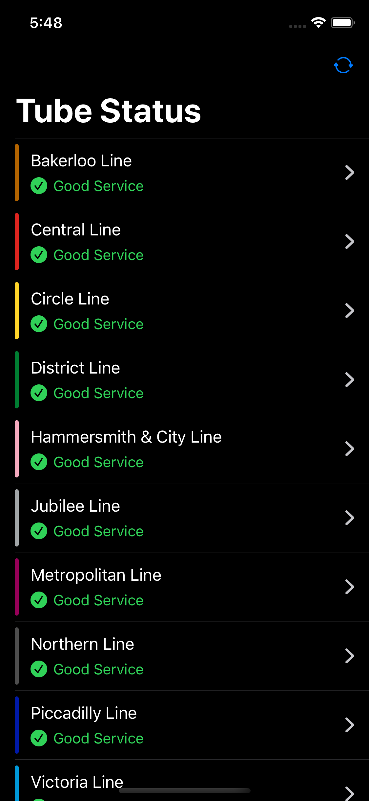

# Tube Status

Tube Status is a demo app using SwiftUI and Combine to fetch London Underground status.

In order to compile and run the code, you need:
1. macOS 10.15 beta
1. Xcode 11 beta
1. iOS 13 beta if running on physical devices

Credit
---
[ra1028/SwiftUI-Combine](https://github.com/ra1028/SwiftUI-Combine)
